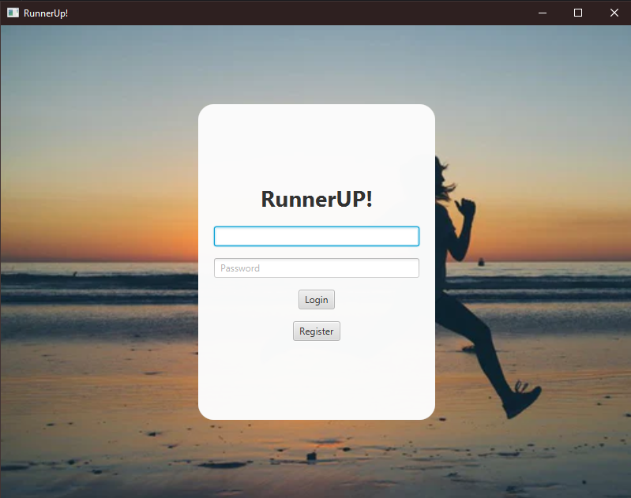
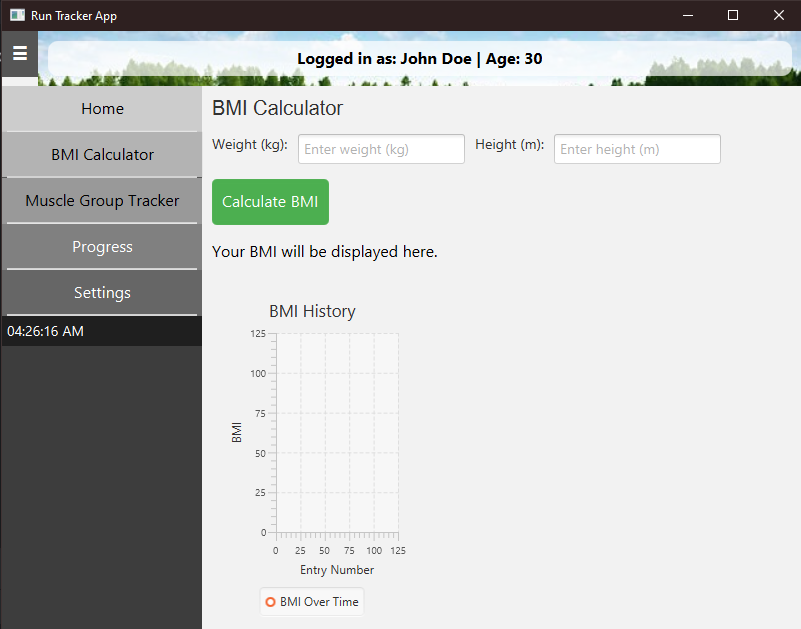
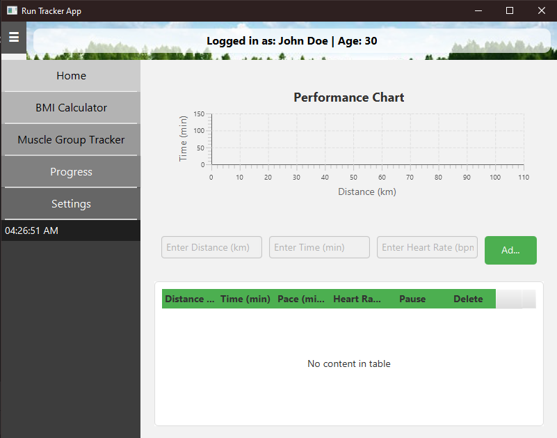

# RunnerUP
Computer Science Advanced Programming Capstone Project
## Table of Contents
 * [Summary](https://github.com/umersiddiqi-school/Run-Tracker-App/blob/main/README.md#summary)
 * [Technologies](https://github.com/umersiddiqi-school/Run-Tracker-App/blob/main/README.md#technologies)
 * [Setup](https://github.com/umersiddiqi-school/Run-Tracker-App/blob/main/README.md#setup)
    * [Prerequisites](https://github.com/umersiddiqi-school/Run-Tracker-App/blob/main/README.md#prerequisites)
    * [Instructions](https://github.com/umersiddiqi-school/Run-Tracker-App/blob/main/README.md#instructions)
 * [Features](https://github.com/umersiddiqi-school/Run-Tracker-App/blob/main/README.md#features)
 * [Intended Users](https://github.com/umersiddiqi-school/Run-Tracker-App/blob/main/README.md#intended-users)
 * [How it Works](https://github.com/umersiddiqi-school/Run-Tracker-App/blob/main/README.md#how-it-works)
    * [Login/Register Page](https://github.com/umersiddiqi-school/Run-Tracker-App/blob/main/README.md#loginregister-page)
    * [Home Page](https://github.com/umersiddiqi-school/Run-Tracker-App/blob/main/README.md#home-page)
    * [BMI Calculator Page](https://github.com/umersiddiqi-school/Run-Tracker-App/blob/main/README.md#bmi-calculator-page)
    * [Health Analysis Page](https://github.com/umersiddiqi-school/Run-Tracker-App/blob/main/README.md#health-analysis-page)
    * [Progress Tracker Page](https://github.com/umersiddiqi-school/Run-Tracker-App/blob/main/README.md#progress-tracker-page)
    * [Settings Page](https://github.com/umersiddiqi-school/Run-Tracker-App/blob/main/README.md#settings-page)
* [Credits](https://github.com/umersiddiqi-school/Run-Tracker-App/blob/main/README.md#credits)

## Summary

The RunnerUP! Application is a comprehensive application designed to allow users to get ahead of their fitness goals. RunnerUP! was designed as the capstone project of the Advanced Programming class by five student programmers. RunnerUP! allows users to set personal running goals, view their historical data, and track their progress. RunnerUP! additionally provides a user insight into their running analytics and offers intuitive fitness recommendations, allowing for a comprehensive running experience.
## Technologies
* **Intellij IDEA** primary IDE
* **Java** JDK version 22
* **Maven** dependency management tool
* **JavaFX** Controls, Graphics, FXML
* **Azure MySQL Database** MySQL Database powered by Microsoft Azure

## Setup
### Prerequisites:

1. **Java Development Kit (JDK)**
    * Version: 22
    * [Download Link](https://www.oracle.com/java/technologies/javase/jdk22-archive-downloads.html)
2. **Apache Maven**
    * [Installation Guide](https://maven.apache.org/install.html)
3. **Microsoft Azure**
    * Setup an Azure Database for MySQL flexible server
    * [Setup Guide](https://azure.microsoft.com/en-us/products/azure-sql/database/?ef_id=_k_CjwKCAiA3ZC6BhBaEiwAeqfvyvBEYfdidY8eK6Cr7DplhG778BkQ3fTP16mBgVt8aVEbjmNoibR0ExoCd2cQAvD_BwE_k_&OCID=AIDcmm5edswduu_SEM__k_CjwKCAiA3ZC6BhBaEiwAeqfvyvBEYfdidY8eK6Cr7DplhG778BkQ3fTP16mBgVt8aVEbjmNoibR0ExoCd2cQAvD_BwE_k_&gad_source=1&gclid=CjwKCAiA3ZC6BhBaEiwAeqfvyvBEYfdidY8eK6Cr7DplhG778BkQ3fTP16mBgVt8aVEbjmNoibR0ExoCd2cQAvD_BwE)
### Instructions

1. **Clone the Repository**
2. **Azure Database Configuration**
   * This project uses the DBConnectivity.java class to initialize the Database connection using the Database's URL and Name. Additionally, it will require the SQL Server URL, the user's username, and the user's password. The above should be placed in the corresponding String variables.
3. **Build the Project**
4. **Run the Project**
# Features
* **Login/Register** Authenticates user or allows them to create an account to start tracking their running data.
* **Home Page** Accessible directly post-login. Contains sidebar allowing for access to BMI Calculator, Progress, Analysis, and Setting page.
* **BMI Calculator Page** Allows a user to calculate their BMI, and additionally creates a chart tracking their BMI over time for visual aid regarding their running journey
* **Progress Tracker Page** Allows user to input their running data and charts the running data. Additionally creates a table that tracks the distance ran, the time the user ran, their pace, and heart rate.
* **Analysis Page** Uses the running data inputted by the user and analyzes it, giving the user recommendations on how they can better improve their health, as well as what types of runs they should focus on.
* **Settings Page** Allows user to configure different settings.

## Intended Users
* **ANYONE including but not limited to:**
  * People looking to get back into shape or lose weight.
  * People trying to increase their physical stamina
  * People requiring a calorie tracker
  * People attempting to improve their physique and health
## How it Works
### Login/Register Page

Upon running the applications, users are displayed a splash screen featuring the app's logo. After the splash screen fades, users are prompted with a window where they can either login using their pre-existing credentials or register as a new user.

**Login**

The user will be prompted to enter their username and password into the login field. The users information will be saved automatically in our Azure database and reused when opened again in the future. 

*This look will be changed before the final submission*

**Register**

If the user is not already registered with the program, the user can select the register button and create their account with a username and password (with password confirmation).

*This look will be changed before the final submission*

### Home Page

Once the user has logged in, the main window appears with a sidebar to navigate to the BMI Calculator, Progress Tracker, Health Analysis, and Settings pages.

Additionally, the home page will show the user an overview of previously inputted information from past sessions. 

The window uses several UI elements such as a BorderPane, buttons, HBoxes, VBoxes, and Labels. We also used circle graphs and line graphs to display to the user their progression over time.

### BMI Calculator Page

The user may navigate to the BMI Calculator page from the home page. In the BMI Calculator page, the user can input their weight and height to calculate their BMI. 

The **calculateBMI** method retrieves the data entered in the corresponding textfields to calculate the users BMI, and then displays it on the screen. Additionally calls the **updateBMIHistoryChart** method.

The **updateBMIHistoryChart** method updates the LineChart with the new data. Once the calculate BMI button is clicked, the **calculateBMI** method displays the user's BMI and update's the BMI history chart using the **updateBMIHistoryChart()** method.

### Health Analysis Page

In the Health Analysis Page, users can choose to have their running data evaluated, and receieve recommendations regarding what types of runs they should focus on.

[Update here regarding specific methods once they are finished]

### Progress Tracker Page

This page allows the user to input their running data. Users can input the distance they run, the time they ran for, and their heart rate. Users can see both a table and a line chart to visualize their running journey.

The **setUpChart** method creates a LineChart using the running data inputted by the user and displays it on the screen.

The **addDataFromInput** method takes the data entered into the corresponding TextFields and adds it to a TableView object.

### Settings Page

This page allows for the user to alter specific settings to better enhance their experience.

[Update here regarding specific methods once they are finished]

## Credits

**Umer Siddiqi**
* Developed the GUI and organized the github repository for clean and straightforward group progress.

**Vincent Serrano**
* Developed the backend and took care of the Azure database, allowing for the user to connect and save their progress to the program.

**Ebubekir Karaoglu**
* Developed the frontend, giving us the skeleton of the program (UI elements and metric design.)

**Muhammad Hamza**
* Developed the muscle tracker to give the user a clear goal and ways to improve themselves. 

**Jason Jimenez**
* Configured and designed a friendly user interface which allowed for straightforward navigation. 
* Created a figma demonstration for the program, and collaborated for the README.

**https://www.figma.com/design/8rDLobYnmijkI7UxDFUUQN/Untitled?node-id=0-1&t=SnD5zA7qMu0PpZvz-1**

## To-Do

**Home Page**
* Create a user-friendly page that quickly shows progression and overall information.

**Settings**
* Allow for the user to clear their information, reset their password, allow for multiple themes, and enable / disable notifications.

**Muscle Training Page**
* Having accessible information for muscle training for the user to go through. 
* This can be done with videos, text, or other methods.

